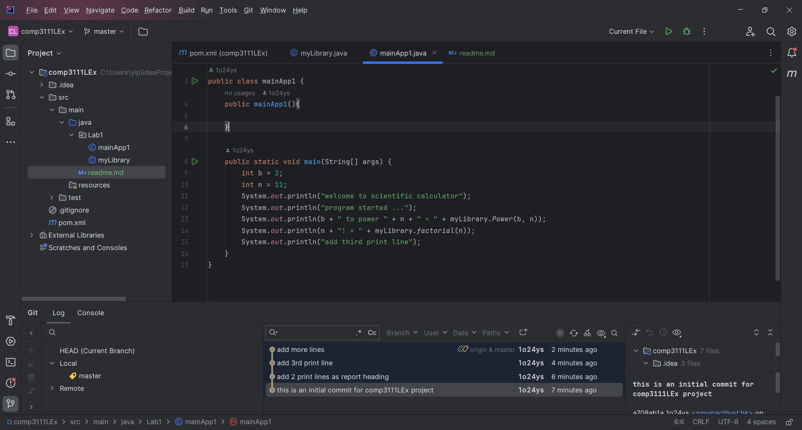

this is my 1st lab in comp3111 - software engineering
1. I have learnt the way to build a java project in intelliJ;
2. I have successfully created my first GitHub to share project source with others;

here's the screenshot of my 1st lab project in intelliJ:

